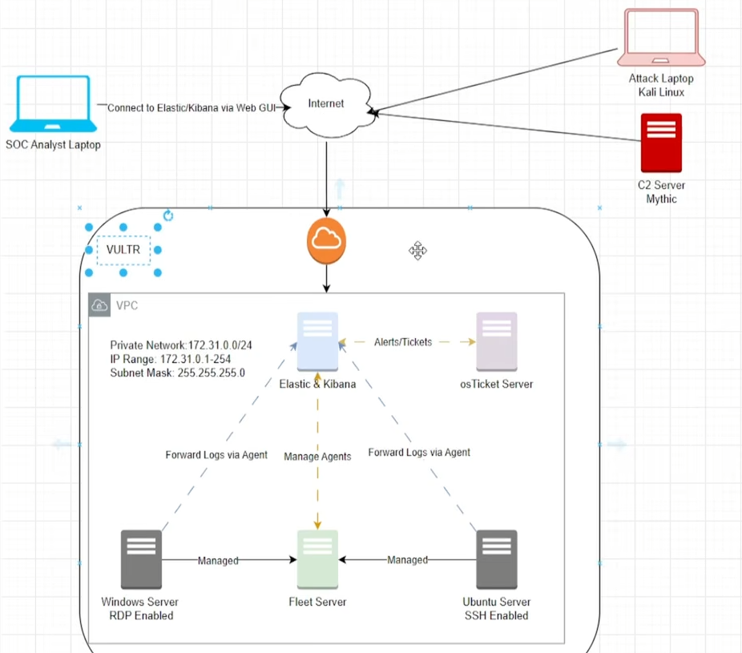

 SOC Lab Architecture

## Overview

This document describes the architecture of the Enterprise SOC Analyst Lab.

The lab was designed to simulate a real-world Security Operations Center (SOC) environment where security events are collected, analyzed, detected, and investigated using enterprise security tools.

The infrastructure is deployed on Vultr Cloud inside a private Virtual Private Cloud (VPC) network.

---

# Architecture Diagram

---

# Infrastructure Components

## SOC Analyst Workstation

The SOC Analyst workstation is used to access Kibana through a web browser for monitoring alerts, investigating security events, performing threat hunting using KQL, and managing Elastic Security.

---

## Vultr Cloud

The entire lab is hosted on Vultr Cloud.

The cloud environment provides isolated virtual machines connected through a private VPC network.

---

## Private Network

Network Range

172.31.0.0/24

Private IP Range

172.31.0.1 – 172.31.0.254

Subnet Mask

255.255.255.0

This private network allows secure communication between all servers without exposing internal traffic to the public Internet.

---

## Elastic Stack

The Elastic Server hosts:

- Elasticsearch
- Kibana
- Elastic Security

Responsibilities include:

- Log collection
- Event storage
- Alert generation
- Dashboard visualization
- Threat hunting
- Detection rule execution

---

## Fleet Server

Fleet Server centrally manages Elastic Agents installed on Windows and Ubuntu endpoints.

Responsibilities include:

- Agent enrollment
- Policy management
- Health monitoring
- Endpoint communication

---

## Windows Server

The Windows Server acts as a monitored endpoint.

It is configured with:

- Remote Desktop (RDP)
- Elastic Agent
- Elastic Defend

Telemetry from this system is forwarded to Elasticsearch for analysis.

---

## Ubuntu Server

The Ubuntu Server is configured with:

- SSH access
- Elastic Agent

Logs generated on this server are forwarded to Elasticsearch for centralized monitoring.

---

## osTicket Server

The osTicket server receives security alerts through a Webhook Connector.

This simulates a real-world SOC ticketing workflow where detected incidents automatically generate investigation tickets.

---

## Kali Linux Attack Machine

The Kali Linux system is used to simulate adversary activity against monitored endpoints.

It is used to validate detection rules and security monitoring capabilities.

---

## Mythic Command and Control (C2)

Mythic C2 is deployed as the command-and-control platform used during attack simulations.

The lab validates:

- Payload generation
- Agent callback
- Post-exploitation commands
- Endpoint detection
- Alert generation
- Incident investigation

---

# Data Flow

1. Elastic Agents collect endpoint telemetry.
2. Fleet Server manages enrolled agents.
3. Endpoint logs are forwarded to Elasticsearch.
4. Detection rules analyze incoming events.
5. Kibana displays alerts and dashboards.
6. Webhook Connectors forward alerts to osTicket.
7. The SOC Analyst investigates alerts using Elastic Security.
8. Kali Linux and Mythic C2 simulate attacker behavior to validate detection capabilities.

---

# Architecture Summary

This architecture demonstrates a complete enterprise SOC workflow, combining cloud infrastructure, endpoint monitoring, attack simulation, centralized log management, threat detection, automated ticket creation, and incident investigation within a single integrated environment.